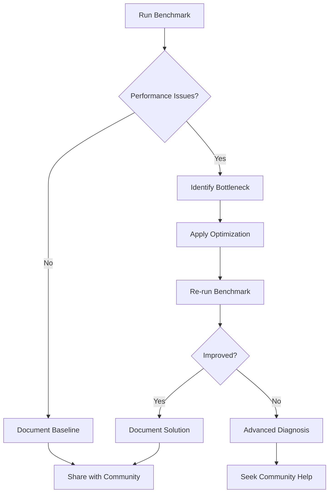

# 📊 KawaiiSec OS Performance & Benchmarking

**KawaiiSec OS Performance Guide** provides comprehensive benchmarking tools, methodologies, and reference metrics to help users evaluate system performance, identify bottlenecks, and optimize their penetration testing environment.

## 🎯 Overview

Performance monitoring and benchmarking are essential for:
- **System Optimization**: Identifying resource bottlenecks and inefficiencies  
- **Hardware Compatibility**: Validating system requirements and capabilities
- **Baseline Establishment**: Creating performance baselines for comparison
- **Community Contribution**: Sharing performance data to improve the distribution
- **Troubleshooting**: Diagnosing performance-related issues

## 🚀 Quick Start

### Run a Complete Benchmark
```bash
# Full system benchmark
make benchmark

# Quick benchmark (skip I/O tests)
make benchmark-quick

# Benchmark with additional artifacts (SVG charts)
make benchmark-artifacts
```

### Using the Script Directly
```bash
# Basic benchmark
./scripts/kawaiisec-benchmarks.sh

# Quick mode (skip I/O tests)
./scripts/kawaiisec-benchmarks.sh --quick

# Save to custom location with artifacts
./scripts/kawaiisec-benchmarks.sh -o /tmp --artifacts

# Verbose output
./scripts/kawaiisec-benchmarks.sh --verbose
```

## 📋 Benchmarking Methodology

### System Information Collection
- **Hardware Details**: CPU model, cores, memory, storage
- **Software Environment**: OS version, kernel, installed packages
- **Current State**: System load, running services, resource usage

### Boot Performance Analysis
- **Boot Time Measurement**: Total boot time breakdown (kernel + userspace)
- **Service Analysis**: Slowest services and critical boot path
- **Startup Optimization**: Identification of optimization opportunities

### Resource Usage Assessment
- **Memory Analysis**: RAM usage, swap utilization, memory pressure
- **CPU Performance**: Load averages, process analysis, temperature monitoring
- **Storage Evaluation**: Disk usage, I/O performance, filesystem health
- **Network Configuration**: Interface status, connection analysis

### I/O Performance Testing
- **Sequential I/O**: Large file read/write performance
- **Random I/O**: Small block access patterns and latency
- **Storage Benchmarks**: Drive-specific performance characteristics

## 🎛️ Benchmark Components

### 1. Boot Time Analysis
```bash
# Measures using systemd-analyze
systemd-analyze time          # Overall boot time
systemd-analyze blame         # Service-by-service timing
systemd-analyze critical-chain # Critical boot path
```

**Key Metrics:**
- **Total Boot Time**: Kernel + userspace initialization
- **Slowest Services**: Top 10 services impacting boot time
- **Critical Path**: Longest dependency chain

### 2. System Resource Analysis
```bash
# Memory assessment
free -h                       # Memory overview
ps_mem                        # Per-process memory usage

# CPU evaluation  
lscpu                         # CPU details
top -bn1                      # Current CPU usage

# Storage analysis
df -h                         # Filesystem usage
du -sh /*                     # Directory usage breakdown
```

### 3. Performance Testing
```bash
# I/O performance
hdparm -Tt /dev/sda          # Drive speed test
dd if=/dev/zero of=test bs=1M count=100  # Write test
ioping /                     # Random I/O latency
```

## 📊 Reference Performance Metrics

### Target System Specifications

#### Minimum Requirements
- **CPU**: 4 cores @ 2.0GHz (Intel Core i5-8250U equivalent)
- **Memory**: 8GB RAM
- **Storage**: 50GB available space (HDD acceptable)
- **Boot Time**: < 45 seconds (cold boot)

#### Recommended Specifications  
- **CPU**: 8 cores @ 2.5GHz (Intel Core i7-10750H equivalent)
- **Memory**: 16GB RAM
- **Storage**: 100GB available space (SSD preferred)
- **Boot Time**: < 25 seconds (cold boot)

#### Optimal Specifications
- **CPU**: 12+ cores @ 3.0GHz (Intel Core i7-12700H equivalent)
- **Memory**: 32GB RAM
- **Storage**: 200GB available space (NVMe SSD)
- **Boot Time**: < 15 seconds (cold boot)

### Typical Performance Ranges

#### Boot Performance
| Metric | Minimum | Recommended | Optimal |
|--------|---------|-------------|---------|
| **Cold Boot Time** | < 45s | < 25s | < 15s |
| **Warm Boot Time** | < 30s | < 15s | < 10s |
| **Kernel Init** | < 8s | < 5s | < 3s |
| **Userspace Init** | < 37s | < 20s | < 12s |

#### Memory Usage (Idle System)
| Component | Minimum | Recommended | Optimal |
|-----------|---------|-------------|---------|
| **Base System** | < 2GB | < 1.5GB | < 1GB |
| **Desktop Environment** | +800MB | +600MB | +400MB |
| **Security Tools** | +500MB | +400MB | +300MB |
| **Total Idle Usage** | < 3.3GB | < 2.5GB | < 1.7GB |

#### Storage Performance
| Test Type | HDD | SATA SSD | NVMe SSD |
|-----------|-----|----------|----------|
| **Sequential Read** | 80-160 MB/s | 400-550 MB/s | 1,500-3,500 MB/s |
| **Sequential Write** | 80-160 MB/s | 300-520 MB/s | 1,000-3,000 MB/s |
| **Random Read (4K)** | 0.5-1.5 MB/s | 25-45 MB/s | 50-80 MB/s |
| **Random Write (4K)** | 1-3 MB/s | 80-120 MB/s | 150-200 MB/s |

#### Service Startup Times
| Service Category | Acceptable | Good | Excellent |
|------------------|------------|------|-----------|
| **Network Manager** | < 5s | < 3s | < 1s |
| **Display Manager** | < 8s | < 5s | < 3s |
| **Security Services** | < 10s | < 6s | < 4s |
| **Desktop Environment** | < 15s | < 10s | < 6s |

## 🖥️ Environment-Specific Considerations

### Virtual Machine Performance
**Expected Performance Impact:**
- **Boot Time**: +20-50% overhead
- **I/O Performance**: 10-30% reduction
- **Memory Overhead**: 200-500MB additional
- **CPU Performance**: 5-15% reduction

**VM Optimization Tips:**
- Enable VT-x/AMD-V acceleration
- Allocate adequate RAM (minimum +2GB host overhead)
- Use SSD storage for VM files
- Enable VM guest additions/tools

### Cloud Instance Performance
**AWS EC2 Reference (t3.large - 2 vCPU, 8GB RAM):**
- **Boot Time**: 25-35 seconds
- **Memory Usage**: ~2.2GB idle
- **Storage**: EBS GP3 performance varies
- **Network**: Baseline performance dependent on instance type

**Optimization for Cloud:**
- Use compute-optimized instances for intensive tasks
- Configure EBS optimized instances
- Monitor CPU credits for burstable instances
- Consider placement groups for network performance

### Container Performance
**Docker Container Overhead:**
- **Memory**: +50-200MB per container
- **CPU**: Minimal overhead with proper resource limits
- **Storage**: Copy-on-write layer performance impact
- **Network**: Bridge networking adds minor latency

## 🔧 Performance Optimization Guide

### Boot Time Optimization
```bash
# Disable unnecessary services
sudo systemctl disable [service-name]

# Use systemd-analyze to identify bottlenecks
systemd-analyze critical-chain
systemd-analyze plot > boot-analysis.svg

# Optimize initramfs
sudo update-initramfs -u
```

### Memory Optimization
```bash
# Identify memory-heavy processes
ps_mem

# Configure swap (for systems with limited RAM)
sudo fallocate -l 4G /swapfile
sudo chmod 600 /swapfile
sudo mkswap /swapfile
sudo swapon /swapfile

# Optimize memory settings
echo 'vm.swappiness=10' | sudo tee -a /etc/sysctl.conf
```

### Storage Optimization  
```bash
# Enable TRIM for SSDs
sudo systemctl enable fstrim.timer

# Optimize mount options for SSDs
# Add 'noatime,discard' to /etc/fstab entries

# Clean temporary files
sudo apt-get clean
sudo apt-get autoremove
sudo journalctl --vacuum-time=7d
```

### Network Optimization
```bash
# Optimize network buffer sizes
echo 'net.core.rmem_max = 16777216' | sudo tee -a /etc/sysctl.conf
echo 'net.core.wmem_max = 16777216' | sudo tee -a /etc/sysctl.conf

# Apply changes
sudo sysctl -p
```

## 📈 Interpreting Benchmark Results

### Boot Time Analysis
- **< 20s Total**: Excellent performance, well-optimized system
- **20-30s Total**: Good performance, minor optimization opportunities
- **30-45s Total**: Acceptable performance, consider service optimization
- **> 45s Total**: Poor performance, requires investigation

**Common Issues:**
- Slow DNS resolution during boot
- Heavy desktop environment initialization
- Network timeout during service startup
- Storage device initialization delays

### Memory Usage Patterns
- **< 2GB Idle**: Excellent efficiency
- **2-4GB Idle**: Normal for desktop environment
- **4-6GB Idle**: High usage, review running services
- **> 6GB Idle**: Excessive usage, investigate memory leaks

**Memory Pressure Indicators:**
- High swap usage (> 1GB)
- Frequent page faults
- OOM killer activity in logs

### Storage Performance Issues
- **Sequential < 50 MB/s**: Likely HDD, consider SSD upgrade
- **Random I/O < 1 MB/s**: Storage bottleneck affecting system responsiveness
- **High I/O wait**: Storage device saturated or failing

## 🤝 Community Contribution

### Submitting Benchmark Results
Help improve KawaiiSec OS by sharing your performance data:

1. **Run Comprehensive Benchmark**:
   ```bash
   make benchmark-artifacts
   ```

2. **Gather System Information**:
   ```bash
   # Hardware details
   lscpu > system-info.txt
   lshw -short >> system-info.txt
   free -h >> system-info.txt
   df -h >> system-info.txt
   ```

3. **Submit Results**:
   - Create a GitHub issue with the "performance-data" label
   - Include benchmark report and system information
   - Specify your use case (VM, bare metal, cloud, etc.)
   - Note any performance issues or optimizations applied

### Performance Database
**Community Performance Database** (GitHub Wiki):
- Searchable performance results by hardware configuration
- Optimization tips and tricks from community members
- Known issues and workarounds for specific hardware
- Baseline comparisons for different deployment scenarios

### Contributing to Optimization
**Help improve KawaiiSec OS performance:**
- Identify and report performance bottlenecks
- Contribute optimization scripts and configurations
- Test performance improvements in pull requests
- Document optimization techniques and best practices

## 🛠️ Troubleshooting Performance Issues

### Common Performance Problems

#### Slow Boot Times
**Symptoms**: Boot takes > 45 seconds
**Diagnosis**:
```bash
systemd-analyze critical-chain
systemd-analyze blame | head -10
```
**Solutions**:
- Disable unnecessary services
- Optimize network configuration
- Update initramfs
- Check for hardware issues

#### High Memory Usage
**Symptoms**: System using > 80% RAM at idle
**Diagnosis**:
```bash
ps_mem
free -h
cat /proc/meminfo
```
**Solutions**:
- Identify memory-heavy processes
- Configure swap appropriately
- Close unnecessary applications
- Check for memory leaks

#### Poor I/O Performance
**Symptoms**: System feels sluggish, high I/O wait
**Diagnosis**:
```bash
iotop
iostat 1
hdparm -Tt /dev/sda
```
**Solutions**:
- Check filesystem health (fsck)
- Optimize mount options
- Consider SSD upgrade
- Monitor for failing hardware

#### Network Performance Issues
**Symptoms**: Slow network connectivity, timeouts
**Diagnosis**:
```bash
ping -c 10 8.8.8.8
iperf3 -c [server]
ethtool [interface]
```
**Solutions**:
- Check network configuration
- Update network drivers
- Optimize network buffer sizes
- Verify physical connections

### Advanced Diagnostics

#### System Monitoring Tools
```bash
# Real-time performance monitoring
htop                          # Interactive process viewer
iotop                         # I/O monitoring
nethogs                       # Network usage by process
powertop                      # Power usage analysis

# Performance profiling
perf top                      # CPU profiling
strace -p [pid]              # System call tracing
tcpdump -i [interface]       # Network packet capture
```

#### Log Analysis
```bash
# System logs
journalctl -u [service]       # Service-specific logs
dmesg | grep -i error        # Kernel error messages
tail -f /var/log/syslog      # System log monitoring

# Performance-related logs
journalctl -u systemd-analyze
grep -i "slow" /var/log/syslog
```

## 📚 Additional Resources

### Performance Tools
- **System Monitoring**: htop, iotop, nethogs, glances
- **Benchmarking**: sysbench, stress-ng, fio, iperf3
- **Profiling**: perf, valgrind, strace, tcpdump
- **Visualization**: grafana, prometheus, collectd

### Documentation Links
- [Boot Time Optimization](https://wiki.archlinux.org/title/Improving_performance/Boot_process)
- [Memory Management](https://www.kernel.org/doc/Documentation/admin-guide/mm/)
- [I/O Performance Tuning](https://wiki.archlinux.org/title/Improving_performance)
- [Network Optimization](https://www.kernel.org/doc/Documentation/networking/)

### Community Resources
- **KawaiiSec OS Forum**: Performance discussion and tips
- **GitHub Issues**: Performance-related bug reports and enhancements
- **Wiki**: Community-contributed optimization guides
- **Discord**: Real-time performance troubleshooting help

---

## 🎯 Performance Monitoring Workflow



**🌸 Keep your KawaiiSec OS running at peak performance! 🌸**

*For questions or contributions, please visit our [GitHub repository](https://github.com/your-org/KawaiiSec-OS) or join our community discussions.* 